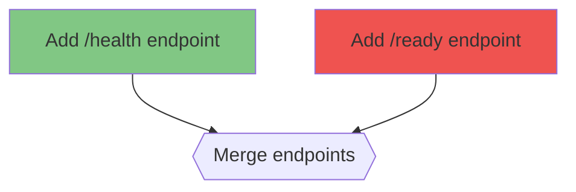

# /flow-graph

Render a DAG task as a mermaid flowchart.

## Arguments

| Name | Required | Default | Description |
|------|----------|---------|-------------|
| `task-id` | Yes | — | The task id whose DAG to render. |

## Behavior

1. Read `dag.json` and `state.json` for the task.
2. Emit a mermaid `flowchart TD` block:
   - Each node is a mermaid node: `node-id["title"]`.
   - Edges from `deps[]` → node.
   - Style by status:
     - `pending` → default
     - `running` → `:::running` class (yellow)
     - `complete` → `:::complete` class (green)
     - `failed` → `:::failed` class (red)
   - Merge nodes use `{{...}}` shape; work nodes use `[...]`.
3. Print to stdout. Also print the file paths of `dag.json` / `state.json` for reference.

## Output example

This is a read-only command. It never writes to state.json or dag.json.
